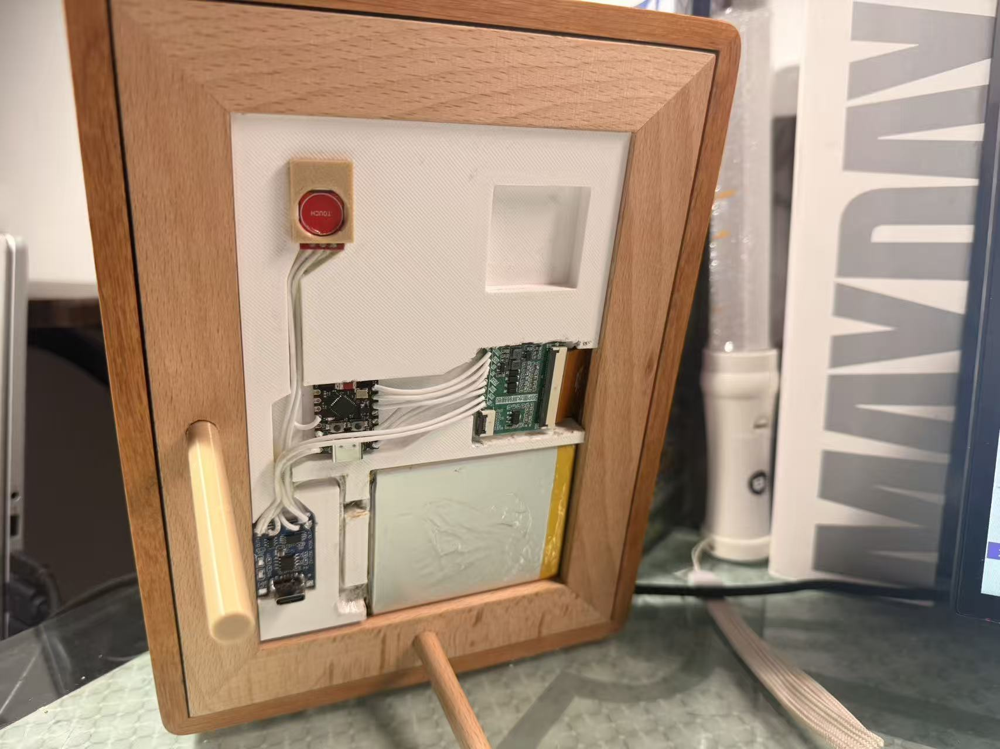
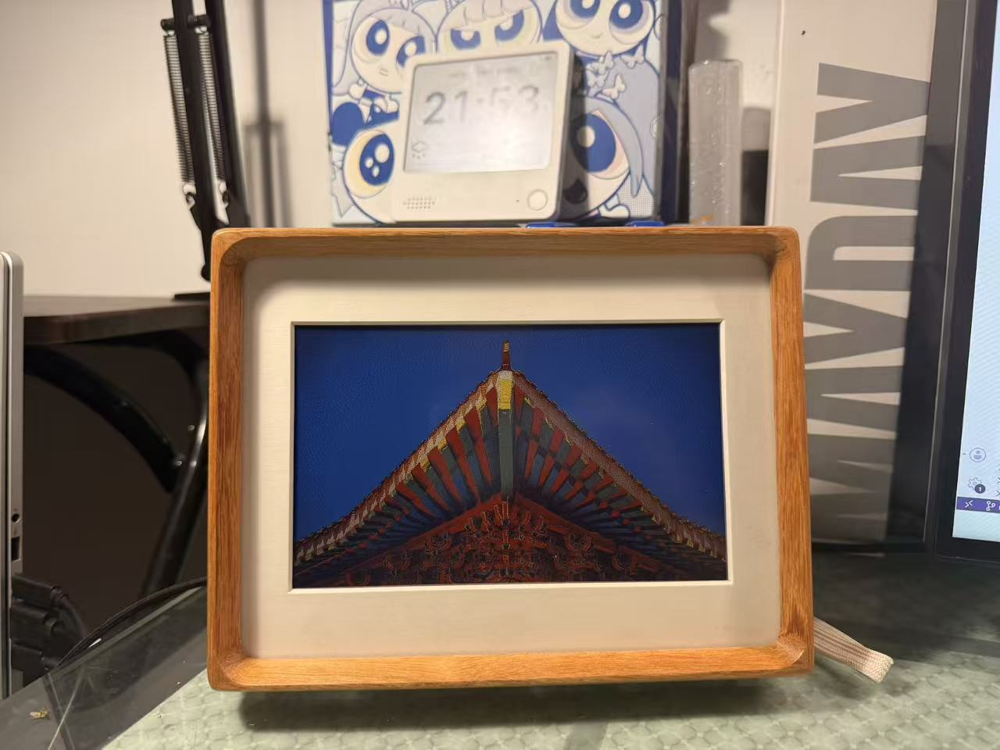
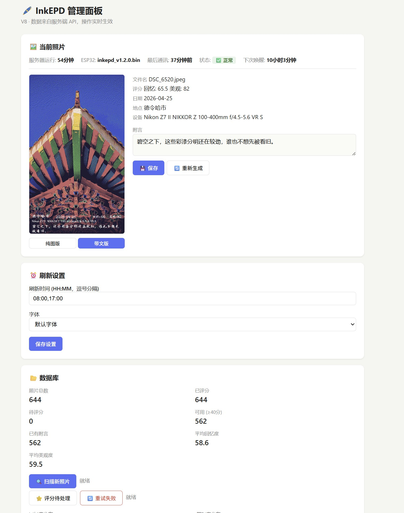

# InkEPD — 把老照片装进墨水屏相框

> **AI 策展 + 全栈个人项目**  
> Qwen VLM 给老照片打分写诗，7 色电子墨水屏轮播  
> 硬件：`ESP32-C3` + `GxEPD2_7C` + `TTP223` 触摸  
> 软件：`Python Flask` + `Pillow` + `SQLite` + `Floyd-Steinberg` 抖动  



---

## 目录

- [一、效果预览](#一效果预览)
- [二、系统架构](#二系统架构)
- [三、硬件](#三硬件)
- [四、核心流程](#四核心流程)
- [五、照片评分](#五照片评分)
- [六、选图策略](#六选图策略)
- [七、附言生成](#七附言生成)
- [八、Web 管理面板](#八web-管理面板)
- [九、部署](#九部署)
- [十、项目统计](#十项目统计)
- [十一、写在最后](#十一写在最后)

---

## 一、效果预览

| 场景 | 预览 |
|------|------|
| 相框实拍 |  |
| 管理面板 |  |
| 选图策略设置 |  |

---

## 二、系统架构

```
┌──────────────────────────────────────────────────┐
│  NAS 服务器                                      │
│  server.py (Flask 常驻)                          │
│  ├── /ink/refresh  ← ESP32 唤醒取图             │
│  ├── /admin        → Web 管理面板                │
│  ├── /api/*        → REST API                   │
│  ├── /health       → 健康检查                   │
│  └── /firmware/*   → OTA 固件下载               │
│                                                  │
│  send_image.py → 选图 + 渲染 + 6色抖动          │
│  analyze_image.py → EXIF + VLM 评分 + 附言      │
└──────────────────┬───────────────────────────────┘
                   │ POST /ink/refresh
                   │ (定时唤醒 / 触摸唤醒)
┌──────────────────▼───────────────────────────────┐
│  ESP32-C3 + GDEY073D46 7.3" 电子墨水屏           │
│                                                   │
│  WiFi → POST → 收384KB帧缓存 → 刷屏 → 深睡       │
│  触摸: 短按切信息栏 / 长按10s联网换图             │
└───────────────────────────────────────────────────┘
```

**核心理念**：ESP32 只做一件事——唤醒、取图、刷屏、睡觉。所有智力工作（选图、渲染、时间计算）交给 NAS 上的 Server。

---

## 三、硬件

| 组件 | 型号 | 说明 |
|------|------|------|
| 主控 | ESP32-C3 | RISC-V, WiFi, 深度睡眠 |
| 屏幕 | GDEY073D46 (Spectra 6) | 7.3寸, 480×800, 6色 |
| 触摸 | TTP223 | GPIO3, 电容触摸 |

### 接线

```
GPIO5  → MOSI      GPIO6  → SCLK
GPIO7  → CS        GPIO10 → DC
GPIO20 → RST       GPIO21 → BUSY
GPIO3  → TTP223
```

### 6 色调色板

```
0: 深蓝(≈黑)   1: 白      2: 黄
3: 红          4: 蓝      5: 绿
```

> 硬件支持 7 色（含橙色），但橙色在屏上偏棕偏暗，舍弃不用。

---

## 四、核心流程

```
┌─────────────────────────────────────────────────────┐
│                     定时器唤醒 (8:00 / 17:00)        │
│                           │                          │
│                     WiFi 连接                        │
│                           │                          │
│               POST /ink/refresh                      │
│                           │                          │
│  ┌────────────────────────▼─────────────────────┐   │
│  │  Server 端                                     │   │
│  │  ① 判定是否需换图 (定时点/用户请求/缓存)      │   │
│  │  ② 选图: 加权随机 ← 数据库评分 ← VLM 打分    │   │
│  │  ③ 横图? 智能裁切 (人脸/主体/梯度三级回退)    │   │
│  │  ④ 生成附言 (优先用库中预生成的)               │   │
│  │  ⑤ 渲染: 渐变暗条 + 2x文字覆盖 → FS抖动       │   │
│  │  ⑥ 返回 384KB × 2 帧缓存 (clean + info)        │   │
│  └──────────────────┬──────────────────────────────┘   │
│                     │                                  │
│              收到帧缓存                                │
│                     │                                  │
│              刷屏 (全刷 ~15s)                          │
│                     │                                  │
│      OTA 检查 (有新固件? 下载→更新→重启)              │
│                     │                                  │
│              深度睡眠 (直到下次唤醒)                    │
└─────────────────────────────────────────────────────┘
```

---

## 五、照片评分

用 Qwen 3.7 Plus 从两个独立维度打分：

**回忆度（memory_score）**：值不值得被记住？  
- 人物合影、亲密瞬间 → +8~15  
- 婚礼、新生儿、毕业、团聚 → 大幅加分  
- 宠物/孩子 → 基础 75 分起跳  
- 随手拍、截图 → 0~39 分  

**美观度（beauty_score）**：纯粹视觉品质  
- 构图讲究、光影优秀 → 大幅加分  
- 过曝欠曝、对焦不准 → 减分  

两分独立，高分照片不一定两个都高（例：纯风景 memory=68、beauty=90）。

### 处理管线

```
NAS 照片库 → 扫描目录 → EXIF 提取 → Qwen VLM 评分 → SQLite 入库
                                                         ↓
                                         选图 → 渲染 → 推送到屏
```

---

## 六、选图策略

加权随机抽选，权重 = 分档权重 × 时间因子 × 历史加成 × 首次加成

```
综合分 = memory_score × 0.6 + beauty_score × 0.4

分档:
  85+ → 权重8, 冷却14天
  70-84 → 权重4, 冷却21天
  55-69 → 权重2, 冷却35天
  <55  → 权重1, 冷却60天

历史加成:
  同月同日 → ×5
  ±3天     → ×2

首次展示 → ×3
```

所有参数可在管理面板 **⚙️ 选图策略** 页面实时调节，无需改代码。

---

## 七、附言生成

**Qwen 看图描述 → DeepSeek 写一句**。两步是因为 DeepSeek 是纯文本模型，无法直接看图。

原则：
- 不描述画面，写"看完画面后心里多出的一句话"
- 优先引用契合的歌词（限定歌手范围），无可引用再原创
- 引用句末标 `——歌手《歌名》`，渲染时出处小字右对齐

附言在评分时**预生成入库**，`do_refresh` 不再现场调 LLM，确保 ~0.5s 出图。

---

## 八、Web 管理面板

访问 `http://你的服务端IP:8765/admin`

| 卡片 | 功能 |
|------|------|
| 🖼️ 当前照片 | 图片预览 + 附言编辑/生成 + 服务端/ESP32 状态 |
| ⏰ 刷新设置 | 修改 REFRESH_TIMES、切换字体 |
| 📂 数据库 | 照片统计 + 评分分布图 + 扫描/评分按钮 |
| ⚙️ 选图策略 | 11 个选图参数实时调节 |

### API 端点一览

| 路径 | 说明 |
|------|------|
| `GET /admin` | 管理面板 |
| `GET/PUT /api/config` | 配置读写 |
| `GET /api/status` | 系统状态 |
| `GET /api/stats` | 数据库统计 + 评分分布 |
| `GET /api/fonts` | 字体列表 |
| `GET /api/current-photo` | 当前照片元数据 |
| `GET /api/current-photo/image` | 当前照片 PNG |
| `POST /api/current-photo/caption` | 生成/保存附言 |
| `GET/PUT /api/selection-params` | 选图参数 |
| `POST /api/scan` | 扫描新照片 |
| `POST /api/score` | VLM 评分 |
| `POST /api/score/retry-failed` | 回落模型重试 |

---

## 九、部署

### 依赖

```bash
pip install flask pillow pillow-heif numpy piexif rembg[cpu] opencv-python
```

### 配置

复制 `config.env.example` 为 `config.env`，填入实际参数。

### 启动

```bash
python3 server.py
# 访问 http://localhost:8765/admin
```

### systemd 守护

```ini
# /etc/systemd/system/inkepd.service
[Unit]
Description=InkEPD Server
After=network.target

[Service]
Type=simple
WorkingDirectory=/path/to/InkEPD
ExecStart=/usr/bin/python3 server.py
Restart=always

[Install]
WantedBy=multi-user.target
```

### ESP32 烧录

Arduino IDE → 打开 `InkEPD.ino`：
- 工具 → 分区方案 → **Custom** → 选 `partitions.csv`
- 修改 `SERVER_IP`、`WIFI_SSID`、`WIFI_PASS`
- 烧录

---

## 十、项目统计

| 指标 | 数据 |
|------|------|
| 照片总量 / 已评分 | ~650 / ~650 |
| 可用照片（≥40分） | ~560 |
| 已有附言 | ~560 |
| ESP32 代码 | ~560 行 |
| Server 代码 | ~1000 行 |
| Python 代码总量 | ~2200 行 |
| framebuffer | 384000 bytes |
| 电池续航（5000mAh） | ~2 年 |

---

## 十一、写在最后

墨水屏是电子设备里少有的"慢媒介"。

它不闪烁、不发光。一张照片可以安静地待一整天。不像手机屏幕，它不会催促你"往下划"。

当 AI 从 600+ 张照片里挑出一张 6 年前的星空，在屏幕下方写下：

> *不数星星了，直接用手电筒和银河连个线。*

你会觉得，这些代码写得值。

---

*硬件：ESP32-C3 + GxEPD2_7C + TTP223*  
*软件：Python Flask / Pillow / Qwen + DeepSeek / SQLite*  
*架构：拉模型 — ESP32 主动拉取，Server 全权渲染*
